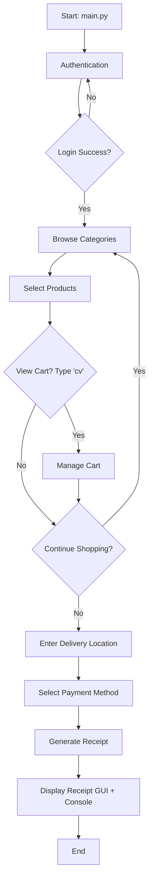

# Pymart - Python Mini Project

## Purpose

Pymart is a **simple online shopping system** created as an educational mini-project for the **Fundamental of Computing** course. It serves as a practical exercise to review and consolidate fundamental programming concepts learned in the 1st semester of Academic Year 1 in Computer Science.

## Technologies

- **Language**: Python 3.x
- **Data Storage**: JSON files (`users.json`, `products.json`)
- **GUI**: Tkinter (for receipt display)
- **Encoding**: UTF-8 (Thai language support)

## How It Works

### Starting Point
Run `main.py` to start the application. The program begins with **Authentication**:

```
1. Login     → Existing users authenticate
2. Register  → New users create accounts
3. Forgot PW → Password recovery via OTP
4. Exit      → Quit the program
```

### Main Workflow



### Flow Details

1. **Authentication** (`src/auth.py`)
   - User login/register → Validates credentials → Loads/saves user data in `data/users.json`

2. **Shopping** (`src/utils.py`, `src/cart.py`)
   - Load products from `data/products.json` (18 categories)
   - Browse products by category
   - Add items to cart
   - Manage cart (increase/decrease quantities)

3. **Checkout** (`main.py`)
   - Enter delivery district → Calculate delivery fee
   - Choose payment method (Mobile Banking or Cash on Delivery)
   - Calculate total (items + delivery)

4. **Receipt** (`src/receipt.py`)
   - Generate receipt with order details
   - Display in GUI window (Tkinter) and console

---

**Note:** This is an educational project for learning Python fundamentals, not for production use.
